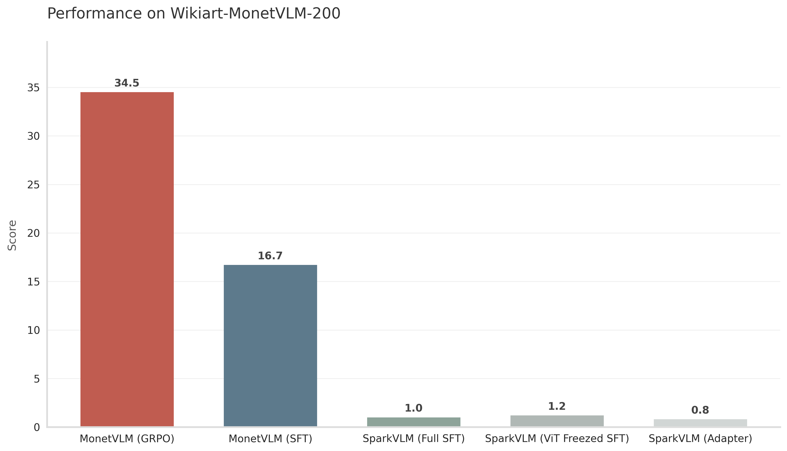

# MonetVLM 🎨

**从零搭建视觉语言模型（VLM）并进行领域微调**

<p align="center">
  
</p>

MonetVLM 是一个完整的 VLM 训练项目，基于 **Qwen3-1.7B** 语言模型和 **SigLIP2-SO400M**视觉编码器从零搭建，实现了从 Adapter 预训练，到联合训练，到领域微调，最后到 GRPO 强化学习对齐的全流程训练。项目以艺术画作风格识别为领域微调背景，通过 SFT + RL 将通用 VLM 适配到特定领域任务。

<p align="center">
  
</p>

## 架构

以 **Qwen3-1.7B** 作为文本模型基座，**SigLIP2** 作为视觉编码器，**两层 MLP 作为 Adapter** 构建了 VLM，并实现了 Qwen2.5-VL 的**动态分辨率**以及 **2*2 token 压缩**。

### 核心设计

- **视觉编码器**：SigLIP2-SO400M，支持动态分辨率输入
- **视觉-语言投影层**：C-Abstractor（2×2 Patch Merger） + 2 层 MLP，将视觉 Token 压缩 4 倍后投影到 LLM 维度
- **语言模型**：Qwen3-1.7B
- **总参数量**：~2.6B

### 显存需求

- **一张 A100 80G** 单卡，没做多卡适配

### 数据集

- 用到的 jsonl 已在本项目仓库中，模型及图片文件链接见 markdown 最下方

## 训练流程

| 阶段 | 脚本 | 训练目标 | 冻结模块 |
|------|------|---------|---------|
| **Phase 0** | `train_proj.py` | Adapter 预训练，学习视觉-语言对齐 | ViT + LLM |
| **Phase 1** | `sft_train_freeze_vit.py` | SFT 指令微调，冻结 ViT | ViT |
| **Phase 2-2.5** | `sft_train_full.py` | SFT 全参微调，解冻所有参数，领域微调同样是这个 | 无 |
| **Phase 3** | `grpo_train.py` | GRPO 强化学习对齐 | 无 |

## 快速开始

### 环境依赖

```bash
pip install torch==2.7.0

 # 必需安装否则爆显存，安不上参考 https://github.com/Dao-AILab/flash-attention/releases 自行下载
pip install flash-attn --no-build-isolation 

pip install -r requirements.txt

# 可选，用于 Web Demo
pip install gradio
```

### VLM 构建
```bash
CUDA_VISIBLE_DEVICES=0 bash train_vlm.sh
```

### 领域微调

```bash
CUDA_VISIBLE_DEVICES=0 bash train_monetvlm.sh
```

### 单独运行 GRPO

预估训练30h，要是嫌训的慢就挑个前3000条训一下得了，反正只是看下有没有效果

```bash
CUDA_VISIBLE_DEVICES=0 python grpo_train.py \
    --model_path save/vlm_sft_full \
    --dataset_path data/wikiart_artist/wikiart_artist_grpo_train.jsonl \
    --val_dataset_path data/wikiart_artist/wikiart_artist_grpo_test.jsonl \
    --output_dir save/vlm_grpo \
    --num_generations 6 \
    --max_completion_length 1024 \
    --mini_batch_size 16 \
    --gradient_accumulation_steps 2 \
    --eval_steps 50
```

### 推理

```python
from inference import load_model, generate

model, processor, tokenizer = load_model(model_dir="save/vlm_grpo")

response = generate(model, processor, tokenizer, "Describe this image.", image_path="pics/test_pic.jpg")
print(response)
```

### Web Demo

```bash
python gradio_app.py
```

## GRPO 算法

**MonetVLM** 实现了 DeepSeek-R1 论文中的 **Group Relative Policy Optimization**。

核心流程：
1. 对每个 Prompt 生成 G 个回复
2. 用奖励函数计算每个回复的奖励 R_i
3. 组内归一化：$A_i = (R_i - mean) / std$
4. 优势裁剪 + KL 散度惩罚

特性：
- **多 Prompt 并行生成**：M 个 prompt × G 个 generation 在 Decode 阶段 batch 并行，类似VeRL
- **预计算视觉特征**：ViT 编码只做一次，G 个 rollout 共享
- **OOM 保护**：显存不足时自动跳过当前 mini-batch，不中断训练
- **Batch 评估**：验证集支持 batch 并行贪婪解码

## 项目结构

```
MonetVLM/
├── vlm_model.py                 # SparkVLM 模型定义文件
├── dataset.py                   # 数据集加载与预处理（动态分辨率、ChatML 格式）
├── train_proj.py                # Adapter 预训练
├── sft_train_freeze_vit.py      # 冻结 ViT 进行 SFT
├── sft_train_full.py            # 全参微调
├── grpo_train.py                # GRPO 强化学习对齐
├── trainers/
│   ├── grpo_trainer.py          # 自定义 GRPO Trainer（纯 PyTorch）
│   └── sft_trainer.py           # 自定义 SFT Trainer
├── reward_functions.py          # GRPO 奖励函数
├── inference.py                 # 推理脚本
├── gradio_app.py                # Gradio Web Demo
├── train_vlm.sh                 # vlm训练脚本
├── train_monetvlm.sh            # 领域微调训练脚本（SFT + GRPO）
└── data/
    ├── sharegpt4v_coco          # 通用图文数据（ShareGPT4V-COCO）
    └── wikiart_artist/          # 领域数据（WikiArt-artist）
```

## 数据格式

为了方便，领域微调时的 SFT 和 GRPO 数据放在了一个 json

### SFT 数据

```json
{
  "image_path": "/path/to/image.jpg",
  "conversations": [
    {"from": "human", "value": "Describe this image.\n<image>"},
    {"from": "assistant", "value": "This is a ..."}
  ]
}
```

### GRPO 数据

```json
{
  "image_path": "/path/to/image.jpg",
  "query": "Select the correct art genre...\n<image>\n\nOptions:\nA. ...\nB. ...",
  "answer": "C",
  "analysis": "This painting depicts...",
  "genre":"Impressionism", # 领域标签，印象派
}
```
## 参考文献
- DeepSeekMath: Pushing the Limits of Mathematical Reasoning in Open Language Models, https://arxiv.org/abs/2402.03300
- Qwen3 Technical Report, https://arxiv.org/abs/2505.09388
- Sigmoid Loss for Language Image Pre-Training, https://arxiv.org/abs/2303.15343

## 模型及数据集图片下载
- Qwen3-1.7B：https://huggingface.co/Qwen/Qwen3-1.7B
- SigLIP2：https://huggingface.co/google/siglip2-so400m-patch14-384
- ShareGPT4V-coco：https://sharegpt4v.github.io/
- WikiArt-artists：https://huggingface.co/datasets/haganelego/wikiart_artists/

## 致谢

- [Qwen3](https://github.com/QwenLM/Qwen3)
- [SigLIP2](https://huggingface.co/google/siglip2-so400m-patch14-384) 
- [DeepSeek-R1](https://arxiv.org/abs/2501.12948)
- [ShareGPT4V](https://sharegpt4v.github.io/)
- [WikiArt](https://www.wikiart.org/)
- [VeRL](https://github.com/verl-project/verl)
